# Frontend Mentor - Newsletter sign-up form with success message solution

This is a solution to the [Newsletter sign-up form with success message challenge on Frontend Mentor](https://www.frontendmentor.io/challenges/newsletter-signup-form-with-success-message-3FC1AZbNrv). Frontend Mentor challenges help you improve your coding skills by building realistic projects.

## Table of contents

- [Overview](#-overview)
  - [The challenge](#-the-challenge)
  - [Screenshot](#-screenshot)
  - [Links](#-links)
- [My process](#️-my-process)
  - [Built with](#-built-with)
  - [What I learned](#what-i-learned)
  - [Continued development](#-continued-development)
  - [Useful resources](#-useful-resources)
  - [AI Collaboration](#-ai-collaboration)
- [Author](#-author)
- [Acknowledgments](#-acknowledgments)

## 📋 Overview

This project is a solution to the Newsletter sign-up form with success message challenge from Frontend Mentor.
The goal was to build an accessible and responsive newsletter subscription interface with form validation and a success confirmation state.

The project focuses on clean architecture, accessibility best practices, and modular JavaScript while following a mobile-first responsive approach.

---

### 🎯 The challenge

Users should be able to:

- Add their email and submit the form
- See a success message with their email after successfully submitting the form
- See form validation messages if:
  - The field is left empty
  - The email address is not formatted correctly
- View the optimal layout for the interface depending on their device's screen size
- See hover and focus states for all interactive elements on the page

---

### 📸 Screenshot

#### Mobile (375x914)

| _Default_ | _Active_ | _Error_ |
| -------------------------- | ------------------------- | ------------------------ |
| 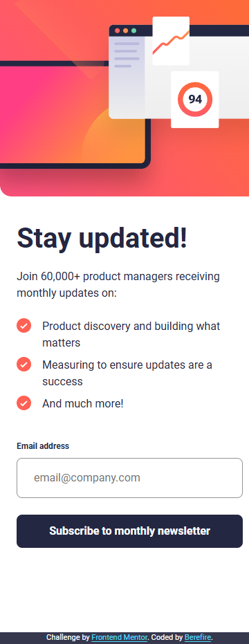 | 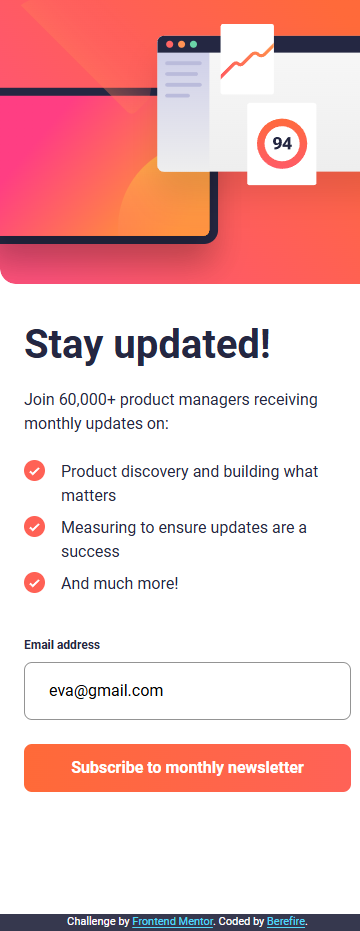 |  |

| _Success Message_ | _Success Message Active_ |
| ------------------ | ------------------------ |
| 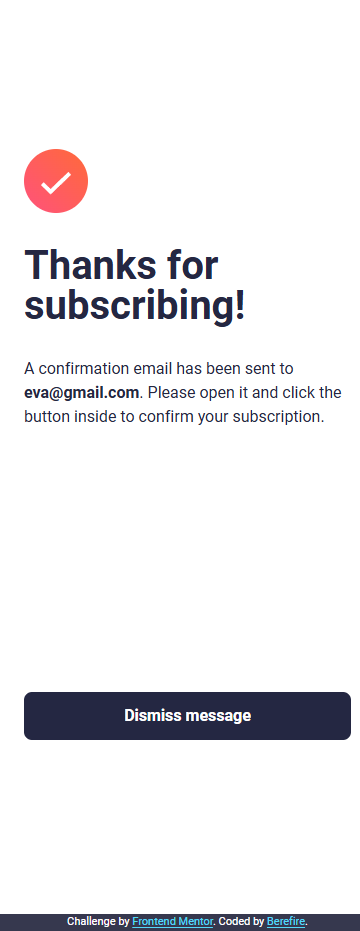 | 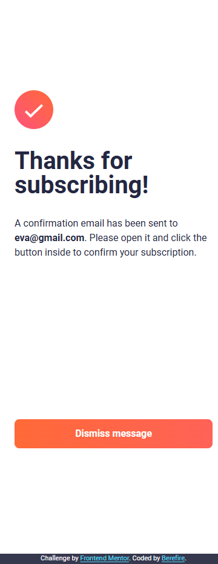 |

#### Tablet (768x914)

| _Default_ | _Active_ | _Error_ |
| -------------------------- | ------------------------- | ------------------------ |
| 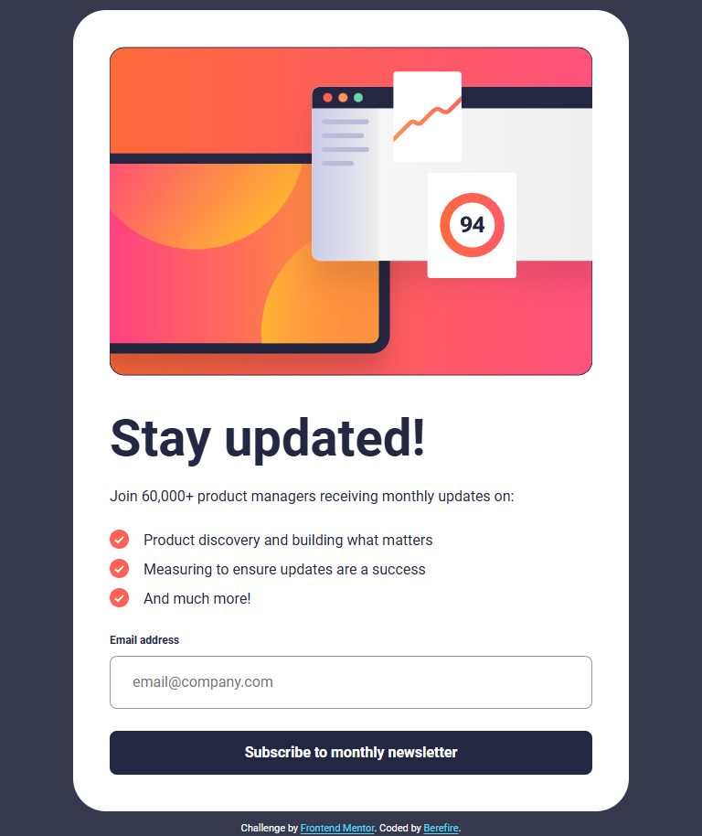 | 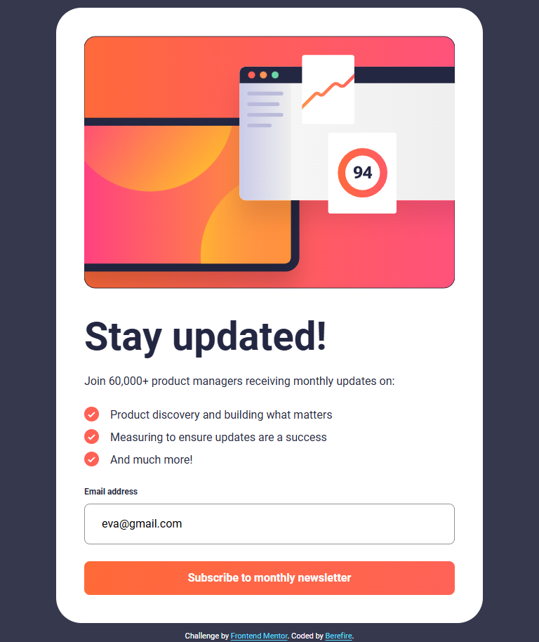 |  |

| _Success Message_ | _Success Message Active_ |
| ------------------ | ------------------------ |
| 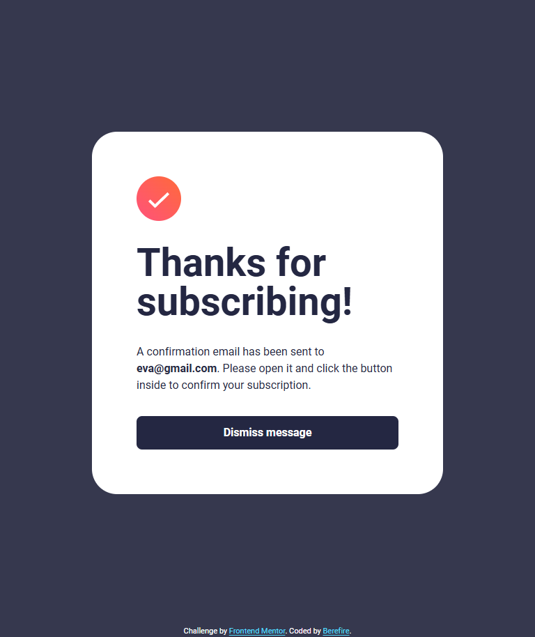 | 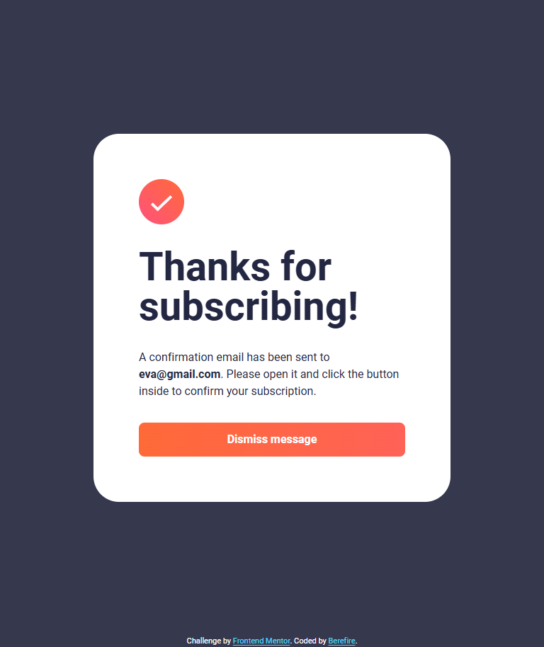 |

#### Desktop (1024x914)

| _Default_ | _Active_ | _Error_ |
| -------------------------- | ------------------------- | ------------------------ |
| 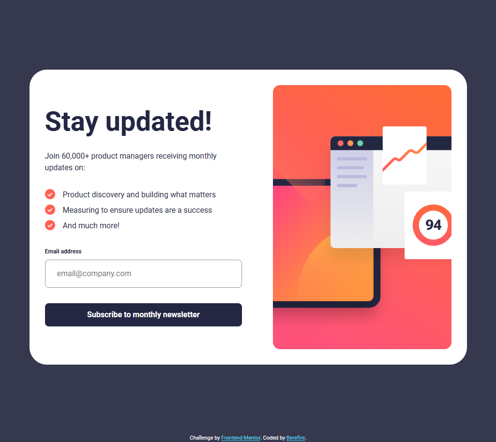 | 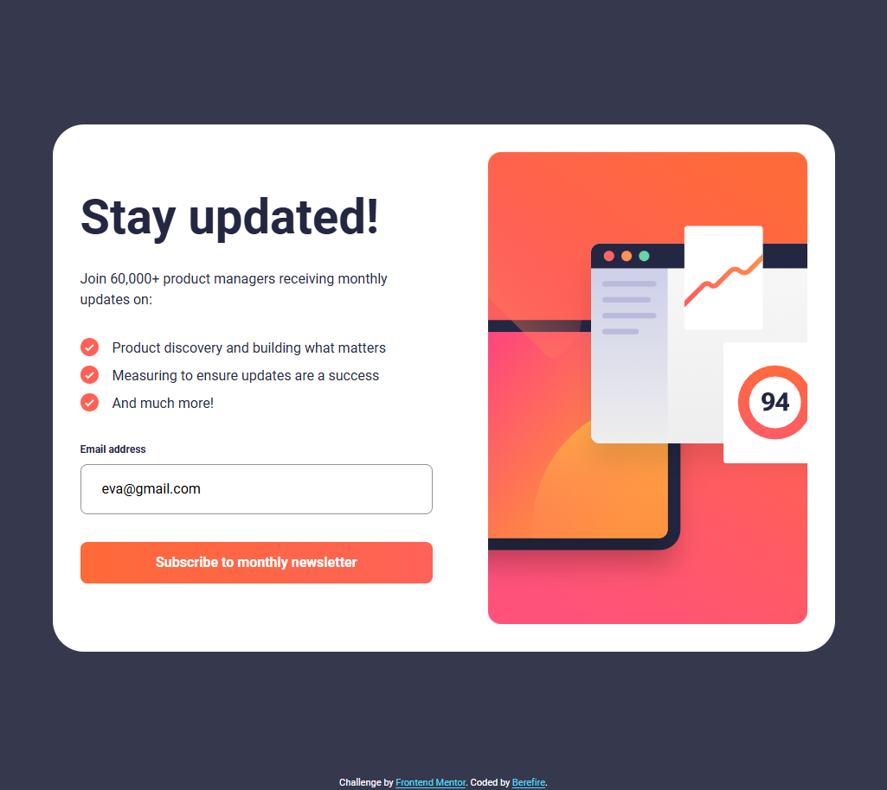 |  |

| _Success Message_ | _Success Message Active_ |
| ------------------ | ------------------------ |
| 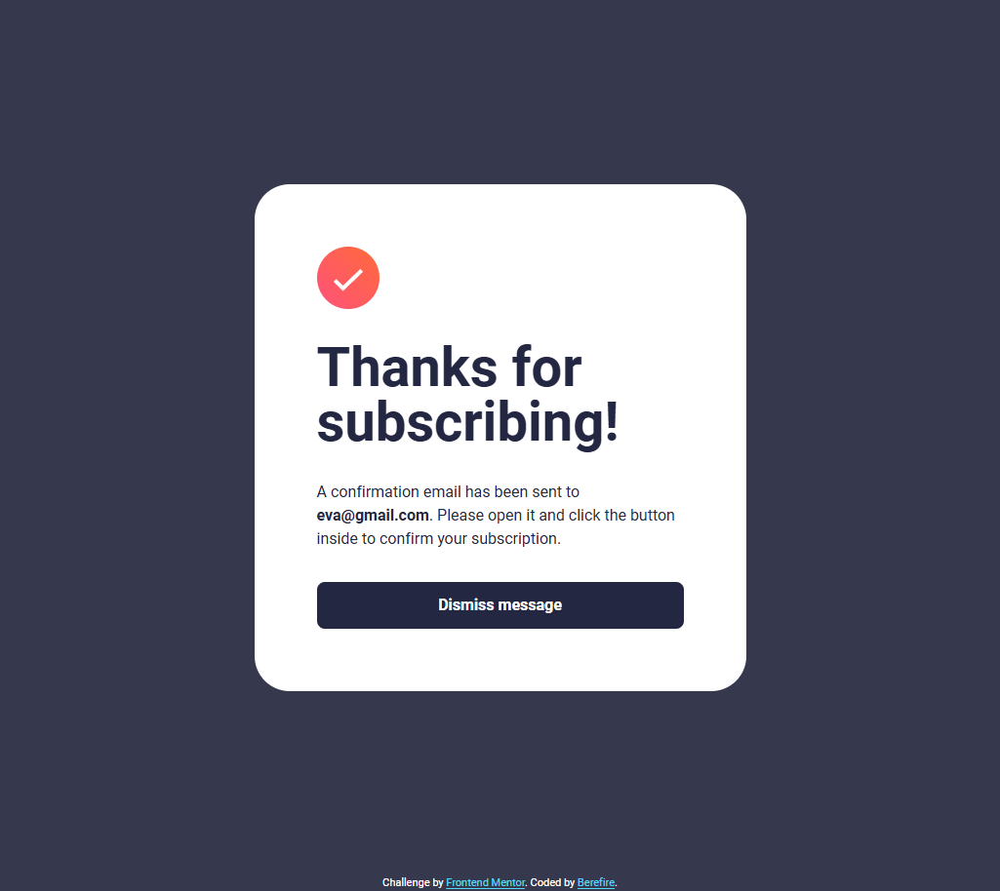 | 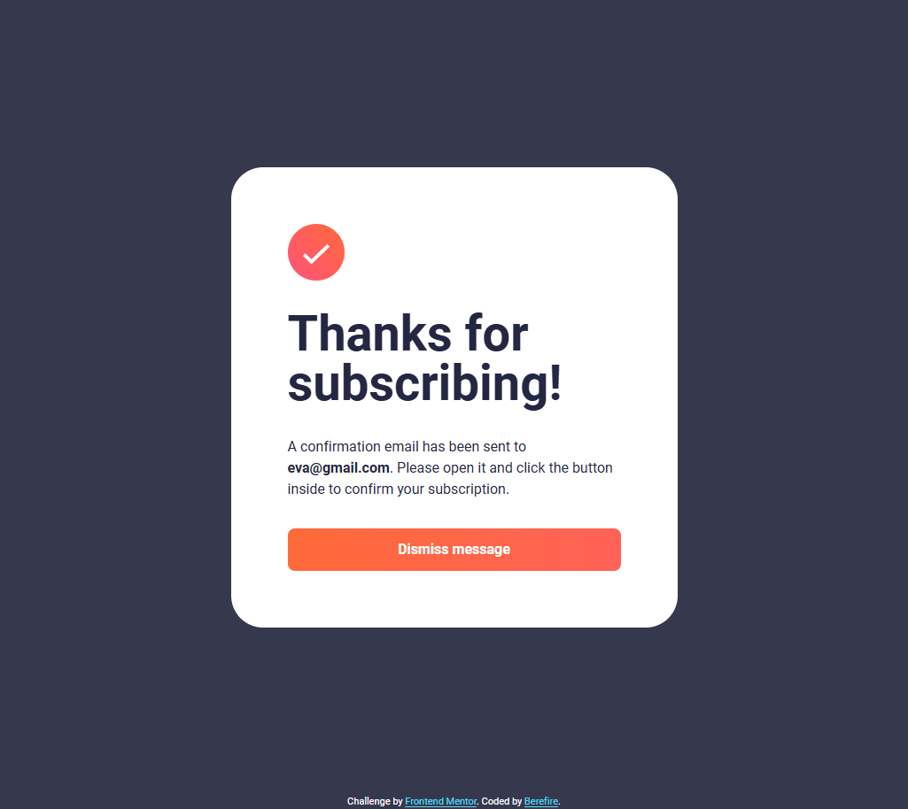 |

---

### 🔗 Links

- Solution URL: [Add solution URL here](https://your-solution-url.com)
- Live Site URL: [https://berefire.github.io/newsletter-sign-up-with-success-message/](https://berefire.github.io/newsletter-sign-up-with-success-message/)

---

## ⚙️ My Process

### 🛠 Built With

- Semantic HTML5 markup
- CSS custom properties
- **CUBE CSS architecture**
- Mobile-first workflow
- **Vainilla JavaScript (ES Modules)**
- **Vite** for development and build tooling
- Accessible form validation
- CSS animations and transitions

---

### What I learned

While working on this project I improved my understanding of several important frontend concepts:

#### Modular JavaScript architecture

I separated responsibilities into different modules:

- validation logic
- UI state handling
- application initialization

This improved maintainability and code clarity.

#### Accessible form validation

I implemented several accessibility improvements:

- `aria-invalid` for invalid inputs
- `aria-live` for error announcements
- keyboard focus management
- semantic HTML labels and input associations

#### Responsive layout design

Using a mobile-first approach allowed the layout to adapt naturally between mobile and desktop. The desktop layout centers the card while the mobile layout allows the form to occupy the full viewport.

#### Animation with accessibility considerations

UI animations were implemented while respecting users who prefer reduced motion using the **prefers-reduced-motion** media query.

---

### 🚀 Continued development

In future projects I would like to further improve:

- advanced form validation patterns
- improved state management patterns in vanilla JavaScript
- deeper accessibility testing with screen readers
- performance optimization for interactive components

I also plan to continue refining my CSS architecture and component-based styling approaches.

---

### 📖 Useful resources

- [MDN Web Docs](https://developer.mozilla.org/es/) - excellent reference for HTML, CSS, and JavaScript
- [WebAIM](https://webaim.org/) - accessibility guidelines and contrast checking
- [Frontend Mentor](https://www.frontendmentor.io) - real-world frontend challenges and design files

---

### 🤖 AI Collaboration

AI tools were used during this project as development assistants to support problem-solving and improve code quality.

#### Tools used

- **ChatGPT** – for explanations, debugging support, and reviewing accessibility improvements.

#### How AI was used

AI was primarily used to:

- Review and improve accessibility practices (ARIA attributes, focus management, keyboard navigation).
- Suggest improvements to CSS architecture and layout patterns.
- Assist in writing and refining project documentation.
- Brainstorm solutions for specific issues such as GitHub Pages deployment and responsive layout adjustments.

#### What worked well

AI was particularly useful for:

- Identifying accessibility improvements that might otherwise be overlooked.
- Suggesting cleaner architectural patterns for organizing JavaScript modules.
- Speeding up documentation and explanations of best practices.

#### What didn't work as expected

Some suggestions required manual adjustments or verification, especially when related to project-specific implementation details.
All AI-generated suggestions were reviewed and adapted to ensure the final code remained clear, maintainable, and fully understood.

---

## 👤 Author

- Frontend Mentor - [@berefire](https://www.frontendmentor.io/profile/berefire)
- GitHub - [@berefire](https://github.com/berefire)

---

## 🙏 Acknowledgments

Thanks to Frontend Mentor for providing practical challenges that help developers improve real-world frontend skills.

---
